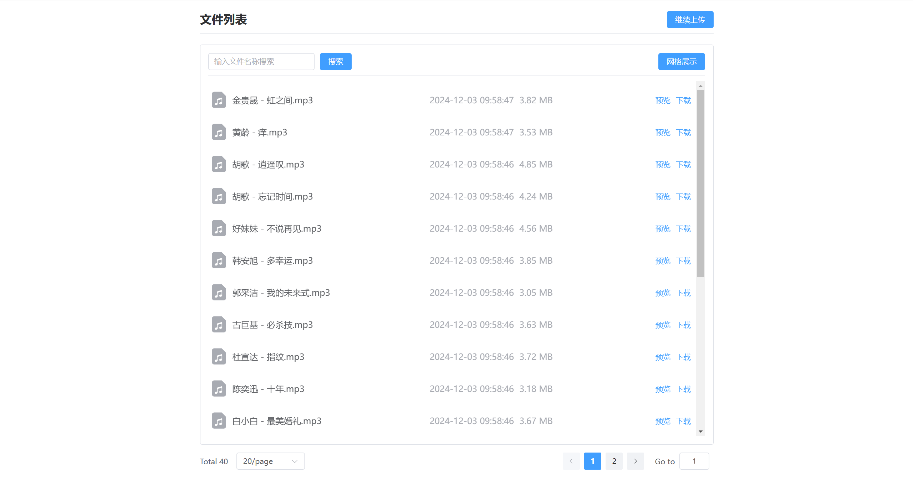

# 大文件上传

这是一个大文件上传的 demo，拖拽部分没啥动力写下去了，这也不是什么难点，只是多加一些事件的处理，这里的多文件选取其实还可以多做一些处理，针对选取的如果是文件夹的话是否递归获取里面的文件。

资源管理本 demo 只是简单的做了展示，如果你有兴趣，可以尝试单独开发一个预览组件，来处理不同类型文件的预览，下载也是采用了一个流式下载，比起在内存中下载会更好一点，缺点是权限验证方面会麻烦一些，当然都是可以解决的，具体就不在展开赘述了。

但是这整体来说是一个相对完整的 demo，如果你前端开发者，且刚学习完 node，不知道如何处理文件上传，可以进行参考，如果多文件部分感觉复杂的话，可以只看最简单的文件上传，体验一下文件上传的感觉也可以。

也因为我是前端出身，所以大部分代码都集中在前端部分，更适合前端开发者进行阅读。

包含如下功能：
- [x] 单文件上传可以选择 base64、form-data
- [x] 批量上传
- [x] 大文件分片上传
- [x] 断点续传
- [x] 上传并发控制

界面UI截图展示：

